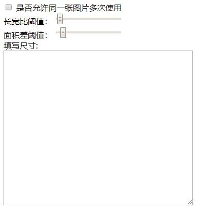
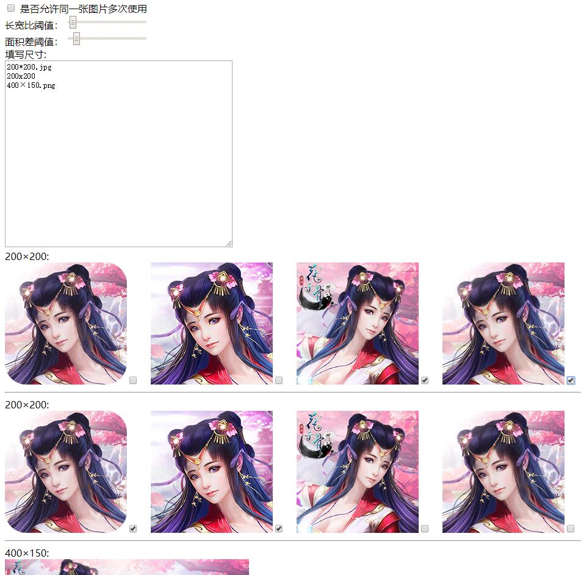
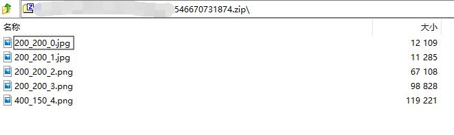

## 项目目的
接平台需要配合平台制作不同尺寸的宣传图片  
导致UI要浪费大量时间配合，仅仅只做修改尺寸的操作，所以制作此简易工具给公司运营人员使用  

## 注意事项
需安装 [GraphicsMagick](http://www.graphicsmagick.org/) or [ImageMagick](http://www.imagemagick.org/)

## 服务器开启方法
1. 执行`npm i`安装相应的node模块依赖文件
2. 执行`tsc -p .`将脚本编译到`dist`目录
3. node ./dist/index.js [图片项目文件路径] [服务端端口号]
4. 在浏览器访问 `http://IP地址:服务端端口号`  

## 示例
如在ip为`192.168.0.150`的服务器上执行了`node ./dist/index.js /data/ImgPath 8135`  
则在浏览器上访问`http://192.168.0.150:8135`  
可看到如下界面  


预先在图片库中准备好一些常用比例的素材(素材要求png,jpg会损失颜色)  
然后再填写尺寸框中输入渠道要求的素材尺寸输入文本框，一个尺寸占用一行：
支持的写法有：
```
200*200
200*200.jpg
400×220.png
400x300.jpg
```
图片可以写后缀和不写后缀，如果不写后缀，默认最终打包生成`png`类型文件  



程序会按长宽比最接近，并且原图面积最接近的算法进行排序，最靠前的是最接近渠道所需的尺寸  
勾选好合适素材后，点击`下载资源`按钮

会将选取的资源按照指定的比例进行缩放，打包到`zip包`中  
其中没有后缀或者后缀为`png`的，将被处理为`png`打到`zip包`  
而后缀为`jpg`会将原始图转换成`jpg`打到`zip包`中  


## svn更新
可将图片目录配置为`svn目录`，并且服务器能全局执行`svn`指令则可调用  
`http://192.168.0.150:8135/update`接口更新服务器上的图片资源  
自行修改 [src/Helper.ts#L31-L34](src/Helper.ts#L31-L34) 中的`svn`用户名和密码